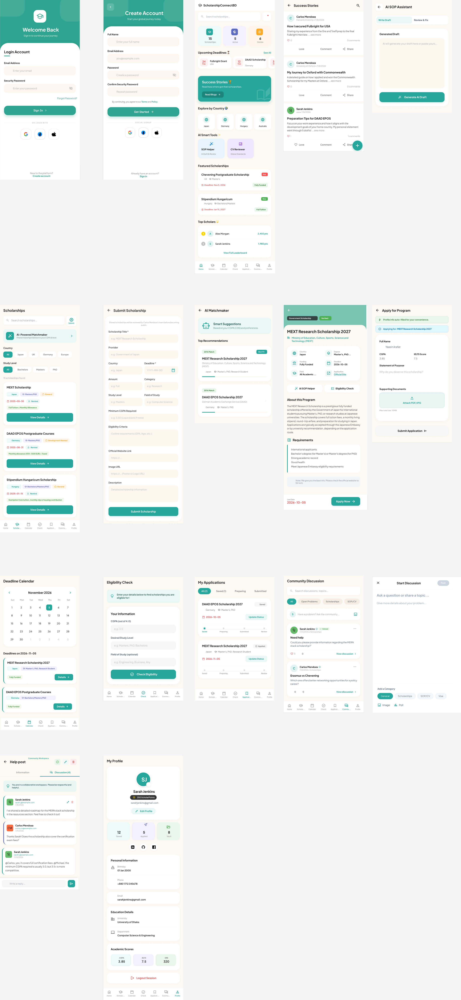

# ScholarshipConnectBD

> **Bridging the gap between Bangladeshi students and global opportunities.**
> A comprehensive mobile platform to discover, track, and apply for international scholarships.

---

## Project Overview
ScholarshipConnectBD is a specialized mobile application built with **React Native & Expo** and powered by a **Django REST Framework** backend. It serves as a central hub for students in Bangladesh to find prestigious scholarships like MEXT, Chevening, Fulbright, and DAAD.

---

## Project Design (Figma)
<p align="center">
  
</p>

---

## Core Features
- [x] **Smart Dashboard**: Real-time announcements and featured scholarships.
- [x] **Scholarship Discovery**: Advanced search and multi-layer filtering (Country, Level, Field).
- [x] **Eligibility Checker**: Instant matching based on CGPA and academic background.
- [x] **Deadline Calendar**: Visual tracking of upcoming application deadlines.
- [x] **Personalized Profiles**: Manage academic history, CGPA, and preferences.
- [x] **Firebase Authentication**: Secure login and registration with backend ID token verification.
- [x] **Web Support**: Full **Expo Web** compatibility for desktop and mobile browsers (Vercel-ready).
- [x] **Advanced Messaging Suite**: Instagram-style UI with Teal gradients, session timestamps, and LinkedIn-style professional reactions.
- [x] **Contextual Support**: Direct "Help" routing from scholarship application cards to Admin with auto-prefilled context.
- [x] **Media Sharing**: Secure image and document sharing within chats for faster application verification.
- [x] **Real-time Messaging**: Direct messaging system for Mentors & Students with Edit/Unsend/Reaction features.
- [x] **Material 3 Admin Console**: Professional Android-style dashboard for system management.
- [x] **Community Discussion**: Interactive forum with "Solved" status tracking and "Open Problems" filtering.
- [x] **Stories & Polls**: Share academic journeys through visual stories and participate in community polls.
- [x] **Mentorship Program**: Connect with verified mentors, book structured 1-on-1 sessions, and track progress through defined states.
- [x] **Student App Manager**: Oversee and approve scholarship submissions from the community.
- [x] **Global Broadcast**: Send instant notifications and alerts to all registered users.
- [x] **Moderation Center**: Protect community standards by managing reported content.
- [x] **Admin Analytics**: Visualize system performance with data-driven insights and KPIs.
- [x] **Activity History**: Audit trail for tracking all administrative actions.
- [x] **Document Vault**: Secure storage for certificates, SOPs, and LORs with image fallback.
- [x] **Deadline Tracker**: Real-time progress tracking for application deadlines.
- [x] **Smart Reminders**: Push notification integration for upcoming deadlines.
- [x] **Scholarship Blog**: Curated articles, success stories, and application guides.

---
## System Architecture & Documentation
For a complete user manual, in-depth system architecture, Data Flow Diagrams (DFD), Entity-Relationship Diagrams (ERD), and our Agile (Scrum) SDLC Workflow, please refer to our core documentation:

- **[Complete User Manual & Documentation](./DOCUMENTATION.md)**
- **[System Design & Architecture](https://github.com/yanayem/ScholarshipConnect-BD/blob/main/backend/docs/SYSTEM_DESIGN.md)**

### Core Diagrams
| Diagram Name | Preview Link |
| :--- | :--- |
| **Entity-Relationship Diagram (ERD)** | [View ER Diagram](https://github.com/yanayem/ScholarshipConnect-BD/blob/main/backend/docs/diagrams/03_er_diagram.png) |
| **System Architecture** | [View Architecture](https://github.com/yanayem/ScholarshipConnect-BD/blob/main/backend/docs/diagrams/04_system_architecture.png) |
| **Data Flow Diagram (Level 1)** | [View DFD Level 1](https://github.com/yanayem/ScholarshipConnect-BD/blob/main/backend/docs/diagrams/02_dfd_level_1.png) |
| **SDLC Agile Workflow** | [View SDLC Process](https://github.com/yanayem/ScholarshipConnect-BD/blob/main/backend/docs/diagrams/01_sdlc_agile.png) |

---
## Phase 2 - Professional Redesign (Latest Updates)
Recently, the platform underwent a significant UI/UX overhaul to meet global academic standards:


### Premium UX & Branding
- **Branded Splash Screen**: A professional logo entrance page with a 1.5s visibility delay, mimicking high-end apps like Facebook.
- **Cross-Platform Support (Expo Web)**: Seamless accessibility via desktop and mobile browsers, optimized for **Vercel** hosting.
- **Vibrant Onboarding**: A redesigned 3-step intro flow (v4) using brand-specific colors (Teal, Lavender, Warning Orange) to educate new users.
- **Educational Layout**: Scholarship details redesigned with a focus on high-readability and professional hierarchy.
- **Immersive Header**: Branded teal background with glass-morphic controls.

### Professional Scholar Profiles
- **Academic Precision**: Dedicated fields for **Major / Course** and **Research Interests** for better AI matching.
- **Researcher Integration**: Direct integration with **Google Scholar** to showcase academic publications.
- **Smart Autocomplete**: Real-time suggestions for Degrees and Sub-fields based on global academic trends.
- **Profile Readiness**: Interactive progress bar indicating profile completion for AI Matchmaking.

### Professional Scholar & Support Communication
- **Messenger-like Experience**: Implemented a modern UI with **Teal Gradients**, dynamic bubbles, and session-grouped timestamps for a fluid chat experience.
- **LinkedIn-Style Reactions**: Users can now react to messages with professional emojis like **Like, Celebrate, Support, Insightful, and Curious**.
- **Contextual Help Routing**: Students can trigger support requests directly from their **Application Cards**. The system automatically pre-fills the chat with application details for the Admin.
- **Media & Image Sharing**: Integrated support for sharing images and screenshots directly within the conversation.
- **Modern Controls**: Support for **Message Editing**, **Unsending** (Delete for Everyone), and **Enter-to-Send** keyboard optimization.
- **Read Receipts**: Real-time visual feedback with single/double-check (Done-all) status icons.
- **Direct Admin Access**: A dedicated "Support" button in the main Inbox for immediate staff assistance.

### Android-Native Admin Console (Full Management Suite)
- **Material 3 Dashboard**: Centralized metrics for scholarships, users, applications, and mentorship sessions.
- **Secondary Security Gate**: Protected by an additional Django-admin login layer for enhanced security.
- **Bulk Upload Tool**: Specialized endpoint for admins to upload 100+ scholarships via a single JSON payload.
- **Moderation Center**: A dedicated system to review reported posts and comments to ensure a safe community.
- **Mentor Approval System**: Evaluate and approve expert mentors to guide younger students.
- **Advanced Analytics**: Interactive charts and progress bars showing user trends, top scholarship countries, and engagement rates.
- **Activity Logs**: A transparent audit trail tracking every admin action for accountability.

### Hybrid Monetization & Pro Tier (New)
- **ScholarConnect Pro**: A premium subscription model inspired by LinkedIn.
- **In-App Payments**: Integrated **SSLCommerz** gateway allowing students to upgrade via **bKash**, Rocket, Nagad, or Cards.
- **In-App WebView**: A seamless, secure payment experience that remains entirely within the mobile application.
- **Pro-Exclusive Features**:
  - **Unlimited AI Suite**: Unlimited SOP writing and CV reviewing.
  - **Priority AI Matchmaker**: Advanced NLP matching with higher precision.
  - **Verified Pro Badge**: Golden badge for increased visibility and trust.
- **Gamified Upgrade**: Active community members can still unlock Pro using **200 ScholarPoints**.

### Scholar Network (LinkedIn Style)
- **Dual-Tab Feed**: Redesigned community hub with "Feed" (Discussions) and "Network" (Mentors).
- **AI Bio Assistant**: Instant profile bio generation using LLM models (Groq/Gemini).
- **Smart Autocomplete**: Real-time suggestions for Countries and Fields based on global database trends.

---

## Business & Monetization Model
ScholarshipConnectBD operates on a **Hybrid-Contribution Model** designed to foster community growth while providing premium academic value.

### 1. Gamified Ecosystem (ScholarPoints)
- **Contribution Earning**: Users earn **50 points** for contributing verified scholarships and **20 points** for solving community problems.
- **Community Driven**: This crowdsourcing ensures the database is always updated with the latest niche opportunities.

### 2. ScholarConnect Pro (Freemium)
The platform offers a premium tier that users can unlock via two methods:
1.  **ScholarPoints**: Cost 200 points earned through community contributions.
2.  **Direct Payment**: Cost 500 BDT (One-time) via the integrated **SSLCommerz** gateway.

- **Premium Benefits**:
  - **Unlimited AI Suite**: Unlimited access to SOP drafting and CV optimization tools.
  - **Priority Matching**: AI-driven alerts for scholarships matching the user's specific profile.
  - **Verified Pro Badge**: A golden "Verified" badge to increase trust in the community.

### 3. Mentorship Marketplace
- **Verified Expertise**: Mentors are vetted by admins and can build a professional reputation within the platform.
- **1-on-1 Guidance**: A structured system for booking and managing personalized scholarship strategy sessions.
- **Session Lifecycle**: Management of session states including `Pending`, `Approved`, `Rejected`, and `Completed`.
- **Technical Note**: Booking requests are processed using the Mentor's **User ID** (linked to their profile) to ensure database integrity.

### 4. AI-Powered Assistance
- **Hybrid AI Matchmaker**: Powered by a **Hybrid Content-Based Recommendation Engine** using **TF-IDF Vectorization** and **Cosine Similarity** to match student bios with scholarship requirements.
- **AI Suite**: Specialized tools for **SOP Writing**, **CV Review**, and **Eligibility Checking**.
- **Usage Tracking**: Detailed logging of AI requests (`AI_REQUEST_LOG`) to enforce rate limits based on user tier.

---

## Technology Stack

### Frontend (Mobile & Web)
- **Core**: React Native & Expo (SDK 56) with **Expo Web** support.
- **Web Runtime**: `react-native-web` & `react-dom` (Vercel optimized).
- **Navigation**: **Expo Router** (Refined with stable history management for Admin tabs)
- **Authentication**: **Hybrid Firebase SDK** (Native for Android/iOS + JS SDK for Web).
- **Styling**: Native StyleSheet with a **Dual-Layer Theme Engine** (Global + Page-Specific professional CSS).
- **Animations**: **React Native Reanimated** for premium fluid transitions.
- **UI Components**:
  - `react-native-calendars`: For scholarship deadline tracking.
  - `@expo/vector-icons`: Material, Ionicons, and FontAwesome5 integration.
  - `expo-image-picker`: Reliable document capture and profile photo uploads.
- **Persistence**: **AsyncStorage** (Cross-platform local storage).

### Backend (API & Data)
- **Framework**: **Django 3.2** (Robust & Scalable Python Framework).
- **Architecture**: **RESTful API** powered by Django REST Framework (DRF).
- **Database**: **MongoDB Atlas** (NoSQL Cloud Database for flexible data schemas).
- **Database Connector**: **Djongo** (Seamlessly maps Django ORM to MongoDB).
- **Auth Verification**: Custom middleware to verify **Firebase ID Tokens**.

---

## Database Architecture
ScholarshipConnectBD utilizes a **hybrid relational-document approach** by leveraging **MongoDB Atlas** via the **Djongo** connector. For a full technical overview, see the [Entity-Relationship Diagram (ERD)](erdigram.md).

### User & Profile Schema (Relational)
The core user data follows a structured relational pattern:
- **User Model**: Standard Django Auth user (Username, Email, Password).
- **Profile Model**: A `OneToOne` extension of the User model containing academic records, personal details, and preferences.

### Scholarship Schema (Document-based)
Scholarship entries are stored as flexible JSON-like documents:
- **Basic Info**: Title, Provider, Country, Amount, and Category.
- **Academic Criteria**: Minimum CGPA, Study Level, and Field requirements.
- **Tracking Data**: Application deadlines, status (Active/Pending/Rejected), and user bookmarks.

---

## UI & Design Theme
The application follows a **Premium, Minimal, and Modern** design system focused on clarity and scholar focus.

### Color Palette
- **Primary**: Sophisticated Warm Teal (`#2A9D8F`) - Main branding and CTAs.
- **Background**: Warm Cream (`#F8F2E7`) - A soft, academic backdrop for high readability.
- **Secondary**: Light Lavender (`#F2ECFF`) - Subtle section highlighting.
- **Surface**: Pure White (`#FFFFFF`) - For cards, modals, and input fields.

### Typography & Spacing
- **Font Family**: `Inter` (Regular, Medium, SemiBold, Bold) for maximum readability.
- **Base Spacing**: 16px (md) grid system.
- **Border Radius**: Professional **24px-36px** for cards and buttons.

---
## Project Structure

```text
ScholarshipConnectBD/
├── mobile/                       # Frontend (React Native + Expo Router)
│   ├── app/                      # Application Screens (File-based Routing)
│   │   ├── (auth)/               # Authentication Flow (Login, Register, Forgot)
│   │   ├── (tabs)/               # Main App Navigation (Dashboard, Search, Saved, Profile)
│   │   ├── admin/                # Android-Style Admin Console (Material 3)
│   │   ├── ai-tools/             # ScholarConnect AI Suite (SOP, CV, Eligibility)
│   │   └── ...                   # Community, Mentorship, Messages, Blog
│   ├── components/               # Reusable UI Components (Cards, Buttons, Inputs)
│   ├── services/                 # Infrastructure Layer (API, Firebase)
│   ├── constants/                # App Config (API_URL, Firebase Keys)
│   └── theme.js                  # Centralized Dual-Layer Theme Engine
├── backend/                      # Backend (Django REST Framework)
│   ├── core/                     # Project Settings & Middleware
│   ├── accounts/                 # User Profiles & ScholarPoints
│   ├── scholarships/             # Scholarship Database & NLP Logic
│   ├── community/                # Discussions, Polls, Stories & Chat
│   ├── ai_assistant/             # LLM Integration (Groq/Gemini)
│   ├── payments/                 # SSLCommerz Integration
│   └── docs/                     # System Design & Diagrams
└── DOCUMENTATION.md              # Full System Manual
```

---

## Environment Setup

### Backend Config (`backend/.env`)
Ensure you have the following variables set up in your Django environment:
| Variable | Description |
| :--- | :--- |
| `MONGODB_URI` | Connection string for MongoDB Atlas. |
| `FIREBASE_SERVICE_ACCOUNT_KEY` | Path to your Firebase service account JSON. |
| `GROQ_API_KEY` | Primary AI provider for SOP and CV tools. |
| `GEMINI_API_KEY` | Fallback AI provider for analysis. |
| `ADMIN_EMAILS` | Comma-separated list for automatic staff access. |

### Frontend Config (`mobile/constants/Config.js`)
Update the `localhost` variable in `Config.js` to match your PC's local IP address if testing on a physical device.

---

## API Endpoints (Quick Reference)
| Category | Endpoint | Method |
| :--- | :--- | :--- |
| **Auth** | `/api/accounts/profile/` | GET/PATCH |
| **Scholarships** | `/api/scholarships/` | GET/POST |
| **AI Tools** | `/api/ai_assistant/matchmaker/` | GET |
| **Community** | `/api/community/` | GET/POST |
| **Payments** | `/api/payments/checkout/` | POST |

---

## Deployment & Production
- **Backend**: Deployable via Gunicorn/Nginx on AWS, Heroku, or DigitalOcean.
- **Frontend**: Managed via **Expo Application Services (EAS)** for Play Store/App Store distribution.
- **Web**: Optimized for **Vercel** with `react-native-web` support.

---

## License
This project is licensed under the **MIT License** - see the [LICENSE](LICENSE) file for details.

---
## Meet the Team

| Student ID | Name | Designation | GitHub |
| :--- | :--- | :--- | :--- |
| 20245103-160 | **Yeasin Arafat Nayem** | Team Leader / Frontend Dev | [yanayem](https://github.com/yanayem) |
| 20245103-133 | **S.M. Azman Sikder Durjay** | Co-Leader / Backend Dev | [azmansikder](https://github.com/azmansikder) |
| 20245103-139 | **Mostar-Shid Billah** | Frontend Developer | [mostarshid](https://github.com/mostarshid) |
| 20245103-151 | **Shudipto Ghosh** | Backend Developer | [shudiptoghosh](https://github.com/shudiptoghosh) |
| 20245103-143 | **Dipta Dey** | QA Engineer / DB Admin | [Dipto-04](https://github.com/Dipto-04) |

### Supervised By:
**Jahid Tanvir**  
Lecturer, Dept. of CSE  
Bangladesh University of Business and Technology (BUBT)

---
*Created for Bangladeshi Scholars.*
