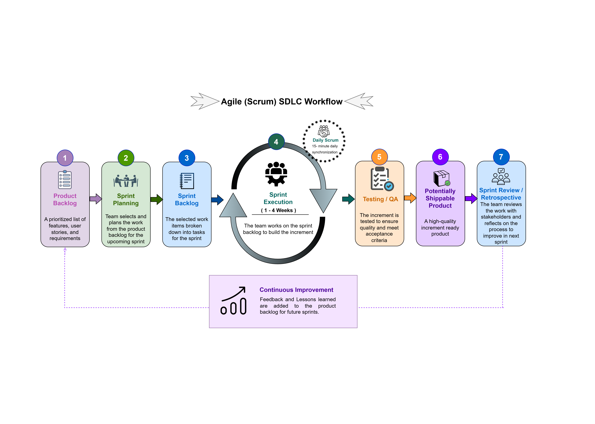
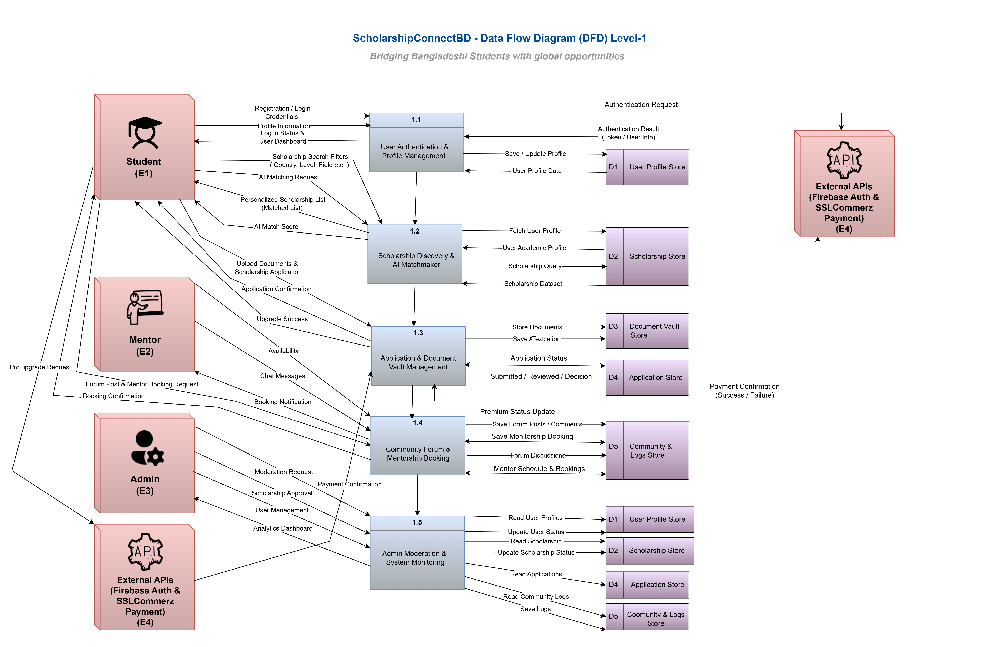
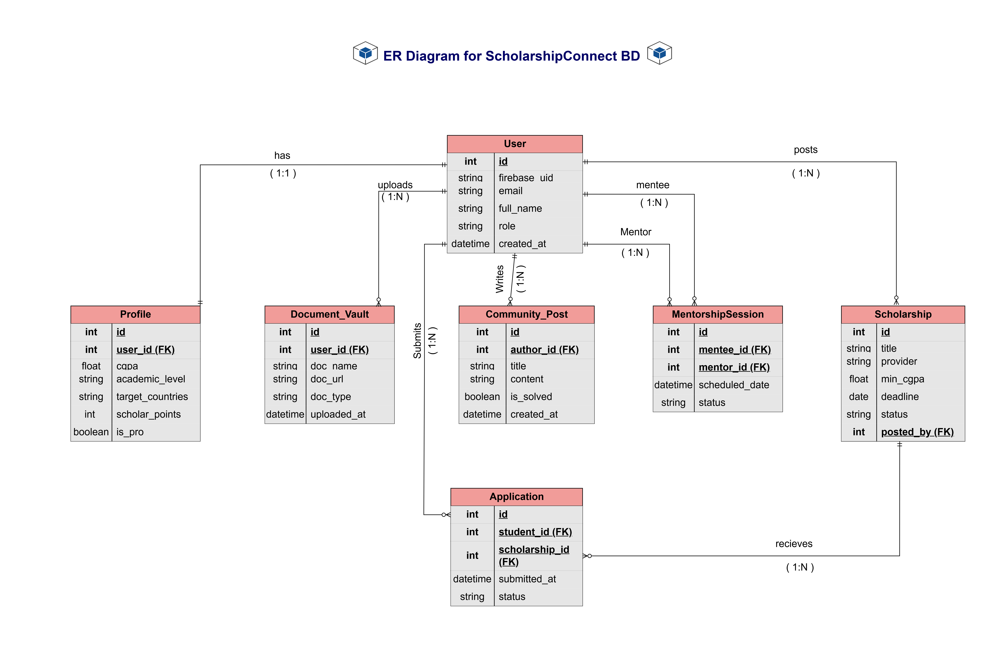
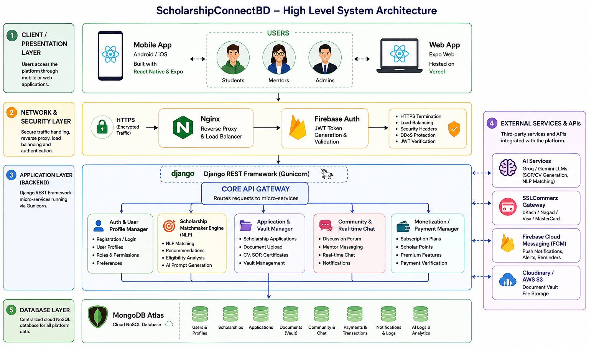
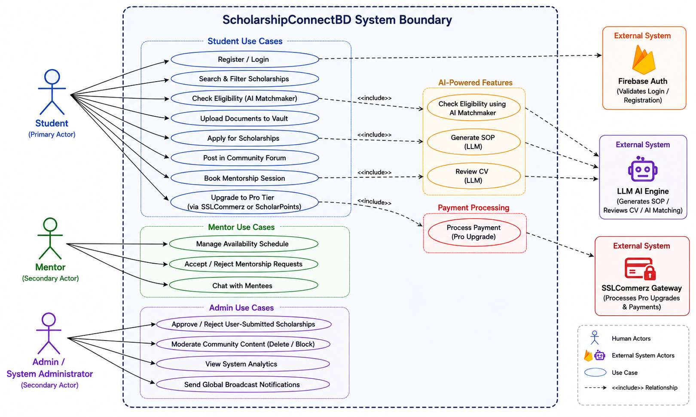
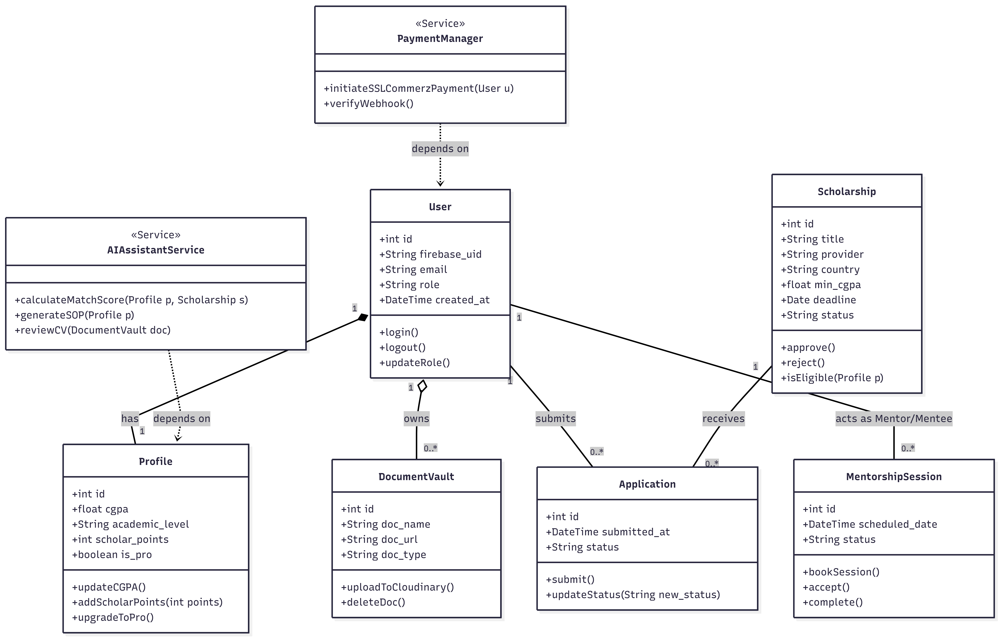

# ScholarshipConnectBD - System Design & Architecture

Welcome to the System Design documentation for **ScholarshipConnectBD**. This document outlines the software development lifecycle, system architecture, data flows, and structural diagrams used to build this highly scalable mobile platform.

---

## 1. SDLC Model Selection: Agile (Scrum Framework)

For the development of ScholarshipConnectBD, the **Agile Development Model utilizing the Scrum Framework** was selected. This model is ideal for our project due to the complex feature set (AI Matchmaker, Secure Vault, SSLCommerz integration) and the necessity for continuous iteration based on testing and stakeholder feedback.

### Agile (Scrum) SDLC Workflow Diagram

*(Figure: Agile Scrum SDLC Workflow of ScholarshipConnectBD)*

### Workflow Phases Detailed:

**1. Product Backlog**
A prioritized list of features, user stories, and requirements. For our project, this included features like the JWT Authentication, ScholarPoints System, AI SOP Generator, and Real-time Chat.

**2. Sprint Planning**
The team (Frontend, Backend, and QA) selects and plans the work from the product backlog for the upcoming sprint. We determined which APIs and React Native screens to build in sync.

**3. Sprint Backlog**
The selected work items are broken down into granular technical tasks (e.g., "Design MongoDB Schema for Mentorship", "Implement NativeWind UI for Dashboard") for the sprint.

**4. Sprint Execution (1 - 4 Weeks)**
The team works on the sprint backlog to build the product increment.
*   **Daily Scrum:** A 15-minute daily synchronization meeting among team members to discuss progress, blockers, and alignment between the Django backend and Expo frontend.

**5. Testing / QA**
The increment is rigorously tested to ensure quality and meet acceptance criteria. This involved Postman API testing, manual UI testing on Android emulators, and checking Firebase authentication flows.

**6. Potentially Shippable Product**
A high-quality, bug-free product increment is ready. For instance, the successful release of the "Material 3 Admin Console" module.

**7. Sprint Review / Retrospective**
The team reviews the completed work with stakeholders and reflects on the development process. 
*   **Continuous Improvement:** Feedback and lessons learned (e.g., optimizing API load times, fixing UI layout shifts) are added back to the product backlog for future sprints.

---
## 2. Data Flow Diagram (DFD)

The Data Flow Diagram maps out the flow of information for any process or system. Below is the **Level-1 DFD** for ScholarshipConnectBD, which provides a detailed breakdown of the main system processes, external entities, data stores, and how data moves between them.

### DFD Level-1 Diagram

*(Figure: Data Flow Diagram Level-1 of ScholarshipConnectBD)*

### Component Breakdown:

#### External Entities (Sources/Sinks)
*   **Student (E1):** The primary user who searches for scholarships, uploads documents, requests mentorships, and applies for programs.
*   **Mentor (E2):** Verified users who provide guidance, manage their availability, and interact via chat.
*   **Admin (E3):** System managers who approve scholarships, moderate the community, and monitor analytics.
*   **External APIs (E4):** Third-party integrations handling secure authentication (Firebase) and payment processing (SSLCommerz).

#### Core Processes
*   **1.1 User Authentication & Profile Management:** Processes login requests via Firebase, handles session tokens, and updates user profiles.
*   **1.2 Scholarship Discovery & AI Matchmaker:** Takes student criteria (CGPA, Level) and runs the NLP matchmaking algorithm against the scholarship database.
*   **1.3 Application & Document Vault Management:** Securely tokenizes and stores uploaded PDFs/Images into the Vault and tracks application status.
*   **1.4 Community Forum & Mentorship Booking:** Manages the routing of forum posts, polls, chat messages, and mentorship scheduling.
*   **1.5 Admin Moderation & System Monitoring:** An overarching process that allows admins to read/write across all data stores for approval, moderation, and analytics.

#### Data Stores
*   **D1 - User Profile Store:** Stores student/mentor metadata, points, and Pro-tier status.
*   **D2 - Scholarship Store:** Contains all active, pending, and rejected scholarship data.
*   **D3 - Document Vault Store:** Secure repository for academic documents (SOPs, Transcripts).
*   **D4 - Application Store:** Tracks the state (Submitted/Reviewed/Decision) of each student's application.
*   **D5 - Community & Logs Store:** Houses forum discussions, chat history, mentorship sessions, and system audit logs.

---
## 3. Entity-Relationship Diagram (ERD)

The Entity-Relationship Diagram represents the data architecture of ScholarshipConnectBD. Although we utilize MongoDB Atlas as our database, we map our data relationally using Django's ORM via Djongo. 

Below is the database schema highlighting the primary tables, attributes, Primary Keys (PK), Foreign Keys (FK), and their relationships.

### ER Diagram

*(Figure: Entity-Relationship Diagram of ScholarshipConnectBD)*

### Table Breakdown & Relationships:

#### Core Entities
1. **User:** The central entity storing authentication mapping (`firebase_uid`), email, and roles (Student, Mentor, Admin).
2. **Profile:** An extension of the User table storing academic metadata (`cgpa`, `academic_level`), gamification data (`scholar_points`), and subscription status (`is_pro`).
3. **Scholarship:** Stores all scholarship opportunities including criteria (`min_cgpa`), deadlines, and the user who posted it.
4. **Application:** The associative entity linking a `User` (Student) to a `Scholarship` with tracking statuses.
5. **Document_Vault:** Secure references to user-uploaded files (SOPs, CVs) mapped via Cloudinary.
6. **Community_Post:** Stores forum queries, polls, and discussions.
7. **MentorshipSession:** Maps one `User` (Mentee) to another `User` (Mentor) for 1-on-1 guidance.

#### Cardinality & Relationships (Crow's Foot Logic)
*   **User ↔ Profile (1:1):** Every registered user has exactly one academic profile.
*   **User ↔ Document_Vault (1:N):** One user can upload multiple academic documents to their vault.
*   **User ↔ Application (1:N):** A student can submit multiple scholarship applications.
*   **Scholarship ↔ Application (1:N):** A single scholarship receives multiple applications from different students.
*   **User ↔ MentorshipSession (1:N):** A user can participate in multiple sessions, either acting as a `mentee` or a `mentor`.
*   **User ↔ Community_Post (1:N):** A user can write multiple posts in the discussion forum.
*   **User ↔ Scholarship (1:N):** A user (Admin/Contributor) can post multiple scholarships.

---
## 4. System Architecture

The System Architecture of ScholarshipConnectBD follows a modern, scalable, multi-tier design. It is built to handle concurrent student requests, secure document management, and AI-assisted processing seamlessly.

Below is the High-Level System Architecture diagram divided into 5 distinct layers.

### High-Level System Architecture Diagram

*(Figure: High-Level System Architecture of ScholarshipConnectBD)*

### Architectural Layers Breakdown:

#### 1. Client / Presentation Layer
This layer represents the user interface where Students, Mentors, and Admins interact with the platform.
*   **Mobile App:** A cross-platform mobile application built with **React Native & Expo**, compiled for Android and iOS.
*   **Web App:** An accessible web version utilizing **Expo Web** and hosted seamlessly on **Vercel**.

#### 2. Network & Security Layer
Ensures all incoming and outgoing data is secure, properly routed, and authenticated.
*   **Nginx:** Acts as a reverse proxy and load balancer. It handles HTTPS termination, security headers, and DDoS protection.
*   **Firebase Auth:** Manages decentralized user authentication, generating and validating secure JWT (JSON Web Tokens) before allowing access to the backend.

#### 3. Application Layer (Backend)
The core logic engine of the platform, powered by **Django REST Framework** running via **Gunicorn**. A central API Gateway routes requests to dedicated micro-services:
*   **Auth & Profile Manager:** Handles registration, roles, and profile preferences.
*   **Scholarship Matchmaker Engine:** Uses NLP logic to analyze eligibility and match students with the right opportunities.
*   **Application & Vault Manager:** Handles scholarship submissions and secure document parsing.
*   **Community & Real-time Chat:** Powers the discussion forum and 1-on-1 mentorship messaging.
*   **Monetization / Payment Manager:** Secures premium subscription (Pro tier) transactions and ScholarPoints tracking.

#### 4. External Services & APIs
Third-party integrations that supercharge the platform's capabilities.
*   **AI Services (Groq / Gemini):** LLM models for drafting/reviewing SOPs, CVs, and intelligent profile matching.
*   **SSLCommerz Gateway:** Handles domestic payment methods like bKash, Nagad, and Cards for the Pro upgrade.
*   **Firebase Cloud Messaging (FCM):** Delivers real-time push notifications, reminders, and broadcast alerts.
*   **Cloudinary / AWS S3:** Secure, external cloud storage for hosting the encrypted Document Vault files.

#### 5. Database Layer
The persistence layer ensuring high availability and flexible data schemas.
*   **MongoDB Atlas:** A cloud-based NoSQL database holding collections for Users, Scholarships, Applications, Documents, Community Chats, Payments, and AI Logs. It communicates with Django seamlessly via Djongo/Motor.

---

## 5. Use Case Diagram

The Use Case Diagram defines the interactions between the system's users (Actors) and the platform's core functionalities. It provides a high-level overview of what each user role can achieve within the ScholarshipConnectBD ecosystem.

### Use Case Diagram

*(Figure: UML Use Case Diagram of ScholarshipConnectBD)*

### Actors & Core Interactions:

#### 1. Student (Primary User)
*   **Discovery & AI:** Can search for scholarships and use the AI Matchmaker to check eligibility.
*   **Application & Vault:** Uploads documents securely and applies directly to targeted scholarships.
*   **Community:** Can post questions, earn ScholarPoints, and book 1-on-1 mentorship sessions.
*   **Monetization:** Upgrades to the Pro tier using integrated payment gateways or earned points.

#### 2. Mentor (Verified Expert)
*   **Guidance:** Manages their schedule, reviews incoming mentorship requests, and communicates with mentees via real-time chat.

#### 3. Admin (System Manager)
*   **Moderation & Control:** Approves community-submitted scholarships, moderates forum content, analyzes system metrics, and broadcasts global alerts.

#### 4. External Systems
*   **Firebase Auth:** Handles the secure registration and login token generation.
*   **AI Engine (Groq/Gemini):** Processes SOP generation and NLP-based eligibility matching.
*   **SSLCommerz:** Facilitates financial transactions for Pro upgrades.

---
## 6. Sequence Diagram

The Sequence Diagram illustrates the step-by-step chronological flow of messages and data between the actors, frontend application, backend APIs, and external services. 

Below is the highly detailed end-to-end Core User Journey, covering Firebase Authentication, the AI Matchmaker engine, Document Vault uploads, and the final Application review process.

### Sequence Diagram: Core Application Workflow

*(Figure: UML Sequence Diagram of ScholarshipConnectBD)*

### Flow Explanation:

#### Flow 1: Secure Authentication
1. The **Student** enters their email and password in the **MobileApp (React Native)**.
2. The App requests authentication from **FirebaseAuth**, which returns a secure JWT Token.
3. The App forwards this Token to the **Django REST API**.
4. The API verifies the ID Token and extracts the UID. 
5. Based on the UID, it checks **MongoDB Atlas**; if the user exists, it fetches the profile. If it's a first login, it creates a new user profile before returning a "Login Success" response to the App.

#### Flow 2: AI Matchmaker & Eligibility Check
1. The Student taps "Check Eligibility", sending their Profile Info (CGPA, Level) to the **Django API**.
2. The API retrieves the specific Scholarship Criteria from **MongoDB**.
3. It combines the student profile with the scholarship requirements and forwards an NLP Matching Request to the **AI Engine (Groq/Gemini)**.
4. The AI Engine returns a Match % and tailored recommendations, which the API formats and sends back to the MobileApp.

#### Flow 3: Secure Document Vault Upload
1. The Student uploads an SOP or CV (PDF/Image) via the MobileApp.
2. The App sends the file via `multipart/form-data` to the **Django API**.
3. The API validates the file type, generates a secure storage URL, and stores the metadata (File URL, Owner, Timestamp) in **MongoDB**.
4. Upon successful database storage, an "Upload Successful" response is returned to the App.

#### Flow 4: Scholarship Application & Admin Review
1. The Student submits their application, sending the payload (including Vault Document IDs) to the **Django API**, which saves the status as "Pending" in **MongoDB**.
2. Asynchronously, an **Admin** logs into the portal and requests the list of pending applications.
3. The Admin reviews the documents and triggers the "Approve Application" action.
4. The Django API updates the application status to "Approved" in MongoDB.
5. Optionally, a Push Notification is triggered to notify the Student of the successful approval.
---
## 7. Class Diagram

The Class Diagram illustrates the Object-Oriented design of the backend structure, mapping directly to our Django REST Framework `models.py` and service layers. It highlights the primary classes, their internal attributes, core operations (methods), and the structural relationships between them using standard UML notation.

### UML Class Diagram

*(Figure: UML Class Diagram of ScholarshipConnectBD)*

### Key Components & Logic:

#### Domain Models (Data Entities)
*   **User & Profile (`Composition`):** The `User` class acts as the core identity handler (managing `firebase_uid` and roles), and it strictly *has* a 1-to-1 composition relationship with the `Profile` class, which holds domain-specific academic data (`cgpa`, `scholar_points`).
*   **DocumentVault (`Aggregation`):** The `User` class *owns* multiple (0..*) `DocumentVault` instances. Even if a document is deleted, the user remains intact.
*   **Scholarship & Application (`Association`):** A `Scholarship` *receives* multiple `Application` objects, and a `User` *submits* multiple applications. This bridges the student to the opportunity.
*   **MentorshipSession (`Association`):** Links a `User` to a session (0..* multiplicity) where they can act as either a mentor or a mentee, handling state transitions like `bookSession()` and `accept()`.

#### Service Classes (Business Logic / Stereotypes)
*   **AIAssistantService (`<<Service>>`):** An independent utility class that *depends on* the `Profile` and `Scholarship` classes. It contains the business logic to generate SOPs (`generateSOP()`) and run the NLP matching algorithm (`calculateMatchScore()`).
*   **PaymentManager (`<<Service>>`):** A service class that *depends on* the `User` class to process Pro tier upgrades via the SSLCommerz gateway (`initiateSSLCommerzPayment()`).
